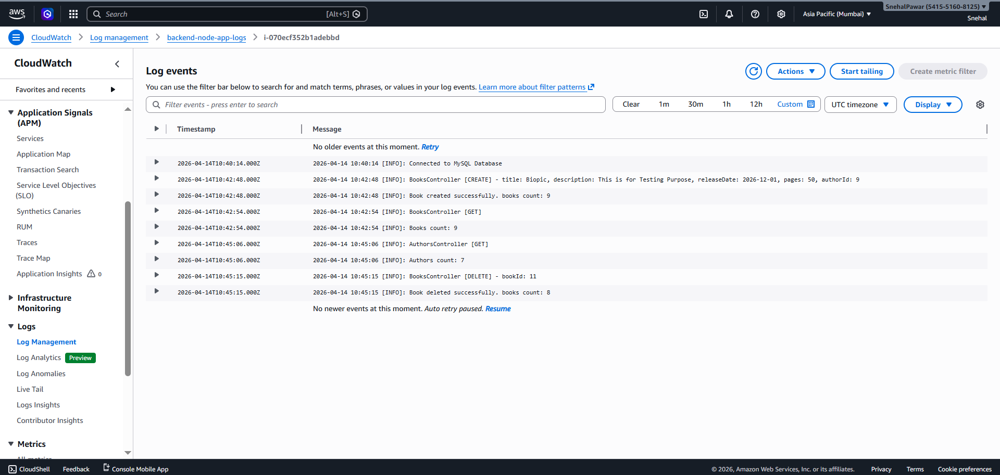

# ☁️ AWS 3-Tier Architecture

<p align="center">
  
  
  
  
  
  
</p>

<p align="center">
  <strong>Design • Deploy • Scale • Secure • Monitor</strong>
</p>

<p align="center">
  A highly available AWS 3-Tier web application architecture
  deployed across multiple Availability Zones.
</p>

---

## 📌 Project Overview

This project demonstrates the **design and deployment of a 3-Tier Web Application Architecture on AWS**, separating the application into three independent infrastructure layers:

- 🌐 **Presentation Tier** — React application served through Nginx
- ⚙️ **Application Tier** — Node.js backend running on EC2
- 🗄️ **Data Tier** — Amazon RDS MySQL

The architecture uses AWS networking, load balancing, Auto Scaling, Multi-AZ deployment, HTTPS, DNS, CloudFront, and CloudWatch monitoring.

The objective was to understand how multiple AWS services work together to build a scalable and highly available application instead of deploying the complete application on a single server.

---

# 🏗️ Architecture

<p align="center">
  
</p>

### 🔄 Application Request Flow

```text
                         🌍 USER
                            │
                            ▼
                       ☁️ CloudFront
                            │
                            ▼
                       🌐 Route 53
                            │
                            ▼
                     ⚖️ Public ALB
                            │
                 ┌──────────┴──────────┐
                 ▼                     ▼
          🖥️ Presentation        🖥️ Presentation
              EC2                    EC2
          Nginx + React          Nginx + React
                 │                     │
                 └──────────┬──────────┘
                            │
                            ▼
                    ⚖️ Internal ALB
                            │
                 ┌──────────┴──────────┐
                 ▼                     ▼
           ⚙️ Application         ⚙️ Application
                EC2                     EC2
           Node.js + PM2          Node.js + PM2
                 │                     │
                 └──────────┬──────────┘
                            │
                            ▼
                     🗄️ Amazon RDS
                          MySQL
                         Multi-AZ
````

---

# 🧩 Architecture Layers

## 🌐 01 — Presentation Tier

The presentation tier handles incoming user traffic and serves the frontend application.

### Components

* Amazon EC2
* Nginx
* React
* Internet-facing Application Load Balancer
* Public subnets
* Auto Scaling

### Responsibilities

* Serve the React frontend
* Handle HTTP/HTTPS requests
* Forward API requests to the application tier
* Distribute traffic across presentation instances
* Scale EC2 capacity based on workload

---

## ⚙️ 02 — Application Tier

The application tier contains the backend business logic and processes API requests.

### Components

* Amazon EC2
* Node.js
* PM2
* Internal Application Load Balancer
* Private application subnets
* Auto Scaling

### Responsibilities

* Process API requests
* Execute application logic
* Communicate with the database
* Return responses to the presentation tier
* Support horizontal scaling

🔒 The application tier is not directly exposed to the public internet.

---

## 🗄️ 03 — Data Tier

The data tier provides persistent database storage for the application.

### Components

* Amazon RDS
* MySQL
* Multi-AZ deployment
* Private database subnets

### Responsibilities

* Store application data
* Process database requests from the application tier
* Provide database availability through Multi-AZ deployment

---

# ☁️ AWS Services Used

| AWS Service                      | Purpose                                              |
| -------------------------------- | ---------------------------------------------------- |
| 🌐 **Amazon VPC**                | Network isolation and infrastructure foundation      |
| 🔲 **Subnets**                   | Separate public, application, and database resources |
| 🖥️ **Amazon EC2**               | Hosts frontend and backend workloads                 |
| ⚖️ **Application Load Balancer** | Distributes application traffic                      |
| 📈 **Auto Scaling**              | Adjusts EC2 capacity based on workload               |
| 🗄️ **Amazon RDS**               | Managed MySQL database                               |
| 🔐 **IAM**                       | Identity and access management                       |
| 🌍 **Route 53**                  | DNS and domain routing                               |
| ☁️ **CloudFront**                | Content delivery and edge distribution               |
| 🔒 **AWS Certificate Manager**   | SSL/TLS certificate management                       |
| 📊 **CloudWatch**                | Metrics, alarms, and application logs                |

---

# 🌍 Network Architecture

The infrastructure is deployed across **two Availability Zones** to avoid depending on a single Availability Zone.

```text
                         AWS REGION
                         ap-south-1
                              │
                ┌─────────────┴─────────────┐
                │                           │
             AZ - A                       AZ - B
                │                           │
        ┌───────┼───────┐           ┌───────┼───────┐
        │       │       │           │       │       │
      Public   App     DB         Public   App     DB
      Subnet  Subnet Subnet      Subnet  Subnet Subnet
        │       │       │           │       │       │
       Web     App     RDS         Web     App     RDS
```

## 🔐 Network Separation

### Public Subnets

* Presentation EC2 instances
* Internet-facing Application Load Balancer

### Private Application Subnets

* Application EC2 instances
* Internal Application Load Balancer

### Private Database Subnets

* Amazon RDS

This separation reduces unnecessary public exposure and provides controlled communication between the application layers.

---

# ⚖️ Load Balancing

Two Application Load Balancers are used for separate traffic paths.

## 🌐 Internet-Facing ALB

The public ALB receives user traffic and distributes it across the presentation tier.

```text
Internet
   │
   ▼
Public ALB
   │
   ├── Presentation EC2
   │
   └── Presentation EC2
```

## 🔒 Internal ALB

The internal ALB handles communication between the presentation and application tiers.

```text
Presentation Tier
       │
       ▼
Internal ALB
       │
       ├── Application EC2
       │
       └── Application EC2
```

This architecture keeps the backend application layer away from direct internet access.

---

# 📈 Auto Scaling

Auto Scaling was configured to allow the architecture to respond to workload changes.

A workload test was performed to observe the behavior of the presentation tier when CPU utilization increased.

```text
Normal Workload
      │
      ▼
Existing EC2 Capacity
      │
      │ CPU increases
      ▼
CloudWatch Alarm
      │
      ▼
Auto Scaling
      │
      ▼
Additional EC2 Capacity
```

### Scaling Flow

**CloudWatch → Auto Scaling → EC2**

This demonstrates how monitoring and automated scaling can work together to respond to changing workloads.

---

# 📊 Monitoring & Logging

Amazon CloudWatch was used to monitor the infrastructure and application environment.

### Monitoring included

* 📈 EC2 CPU utilization
* 🚨 CloudWatch alarms
* 📋 Application logs
* 🔍 Workload testing
* 🔄 Auto Scaling behavior

### Application Logging

Application logging was implemented to make backend activity easier to observe and troubleshoot.

## 📸 CloudWatch Monitoring

<p align="center">
  
</p>

---

# 🔐 Security

Security was considered at both the network and AWS service levels.

### Security Approach

* 🔒 Application and database resources are placed in private subnets
* 🛡️ Security Groups control traffic between tiers
* 🔑 IAM is used for AWS identity and access management
* 🌐 Only required public-facing components are exposed
* 🔒 HTTPS is configured using AWS Certificate Manager
* 🗄️ Database access is restricted to the application layer

The architecture follows the principle of allowing communication only where required between the different tiers.

---

# 🌍 Domain & HTTPS

A custom domain was configured using **Amazon Route 53**.

```text
User
 │
 ▼
Custom Domain
 │
 ▼
Route 53
 │
 ▼
CloudFront
 │
 ▼
AWS Application
```

HTTPS was configured using an SSL/TLS certificate managed through **AWS Certificate Manager**.

---

# ☁️ CloudFront

Amazon CloudFront was added as the content delivery layer.

### Demonstrated Benefits

* 🌍 Edge-based content delivery
* ⚡ Reduced latency for cached content
* 🔒 HTTPS support
* 🔗 Integration with the application domain

---

# 🛠️ Technology Stack

### ☁️ Cloud

`AWS`

### 🖥️ Compute

`Amazon EC2`

### 🌐 Networking

`VPC` • `Subnets` • `Route Tables` • `Internet Gateway`

### ⚖️ Traffic Management

`Application Load Balancer` • `Auto Scaling`

### 🗄️ Database

`Amazon RDS` • `MySQL`

### 🌍 DNS & Content Delivery

`Route 53` • `CloudFront`

### 🔐 Security

`IAM` • `Security Groups` • `AWS Certificate Manager`

### 📊 Monitoring

`CloudWatch` • `CloudWatch Logs` • `CloudWatch Alarms`

### 💻 Application

`React` • `Node.js` • `Nginx` • `PM2`

### 🐧 Operating System

`Linux`

### 🔧 Version Control

`Git` • `GitHub`

---

# 📁 Repository Structure

```text
aws-3-tier-architecture-project/
│
├── 📂 Documentation/
│   ├── Architecture diagrams
│   ├── AWS implementation screenshots
│   ├── Configuration documentation
│   └── Project progress documentation
│
├── 📂 frontend/
│   └── React application
│
├── 📂 backend/
│   └── Node.js application
│
└── 📄 README.md
```

---

# 📚 Project Documentation

The detailed implementation documentation is available inside the:

### 📂 [Documentation](./Documentation)

folder.

It contains:

* Architecture diagrams
* AWS implementation screenshots
* Configuration references
* Project progress documentation
* Monitoring screenshots
* Deployment evidence

---

# 🧪 Validation & Testing

The architecture was validated through multiple stages of testing.

### Application Testing

* ✅ Application accessibility
* ✅ Presentation-to-application communication
* ✅ Application-to-database connectivity

### AWS Infrastructure Testing

* ✅ Load balancer health checks
* ✅ Multi-AZ resource deployment
* ✅ Auto Scaling workload testing
* ✅ CloudWatch alarm behavior
* ✅ Application logging
* ✅ Custom domain resolution
* ✅ HTTPS configuration

---

# 💡 Key DevOps & Cloud Concepts Demonstrated

This project provided hands-on experience with:

* ☁️ AWS cloud architecture
* 🏗️ 3-Tier architecture design
* 🌐 VPC networking
* 🔒 Public and private subnet design
* ⚖️ Load balancing
* 📈 Horizontal scaling
* 🗄️ Managed databases
* 🌍 DNS management
* 🔐 HTTPS and certificate management
* 📊 Infrastructure monitoring
* 📝 Application logging
* 🐧 Linux administration
* 🔧 Git and GitHub
* 🧩 Troubleshooting distributed applications

---

# 🎯 What This Project Demonstrates

The project demonstrates how a traditional full-stack application can be separated into independent infrastructure layers and deployed on AWS with:

```text
Scalability
     +
High Availability
     +
Network Isolation
     +
Load Balancing
     +
Monitoring
     +
Secure Application Access
```

The implementation helped build practical understanding of how AWS compute, networking, database, DNS, security, content delivery, and monitoring services work together as a complete cloud environment.

---

# 🚀 Skills Practiced

<p align="center">


</p>

---

# 👨‍💻 Author

## Snehal Pawar

**Aspiring DevOps Engineer | AWS | Cloud | Linux**

<p>
  <a href="https://github.com/snehalpawar29">
    
  </a>
  <a href="https://www.linkedin.com/in/snehalpawar29/">
    
  </a>
</p>

---

<p align="center">
  ☁️ <strong>Built to Learn. Designed to Scale.</strong> 🚀
</p>
